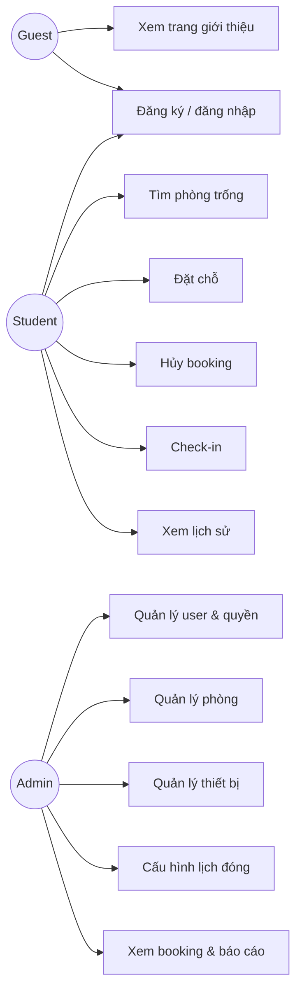
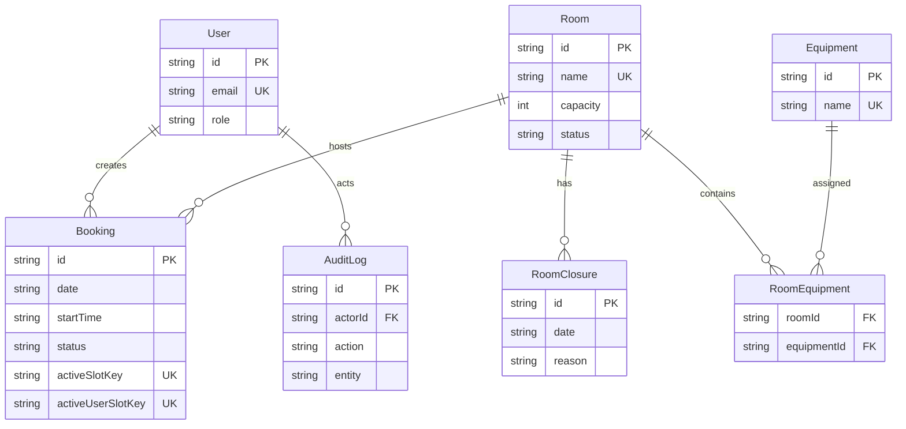
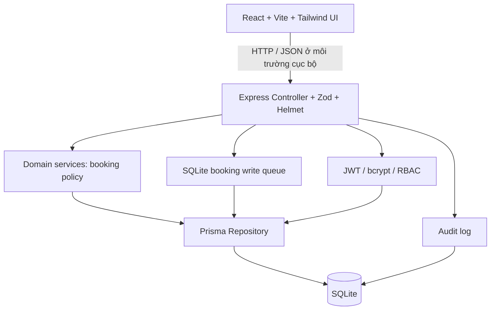

# Sơ đồ thiết kế StudySpace

## Use Case Diagram

## ERD

## Component Diagram và kiến trúc 3 tầng

> Phạm vi được kiểm thử trong repository chạy qua HTTP trên loopback. HTTPS chỉ là yêu cầu của môi trường triển khai thực tế và chưa được chứng minh bởi evidence hiện có.

- Presentation: React screens cho Student và Admin.
- Application/domain: Express route, validation, RBAC, hàng đợi write booking cho SQLite và các quy tắc slot/booking thuần.
- Data: Prisma transaction, hai unique active-key booking, SQLite và audit trail.
