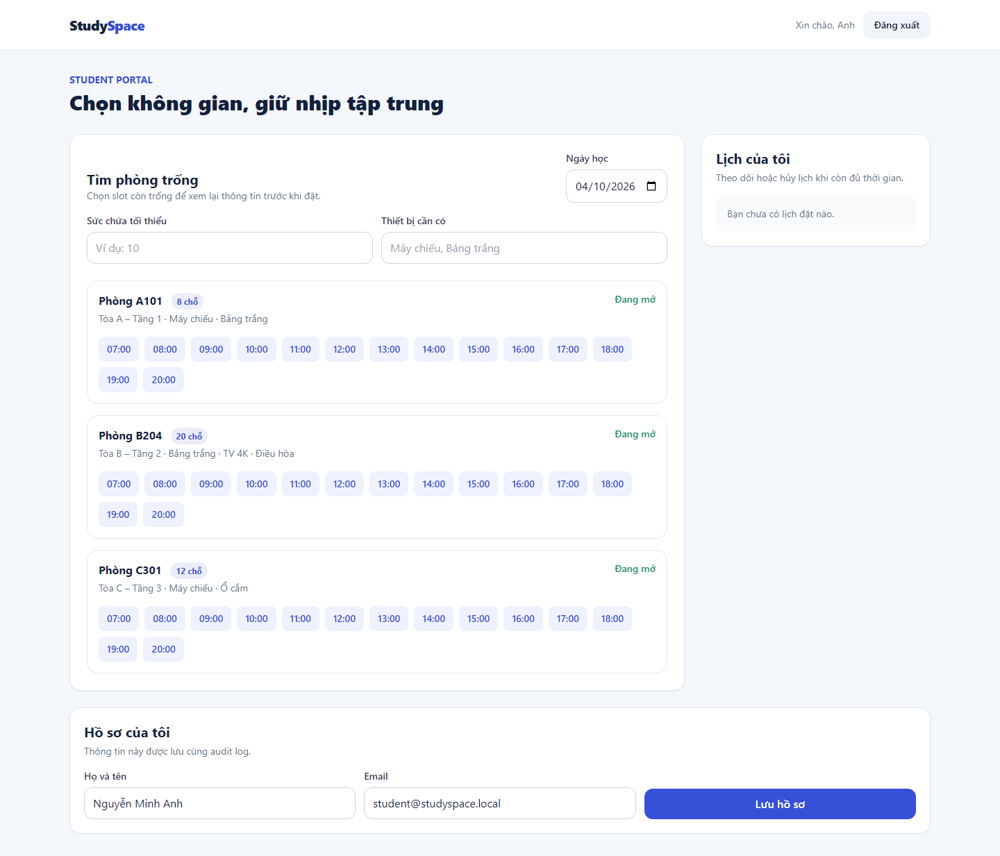
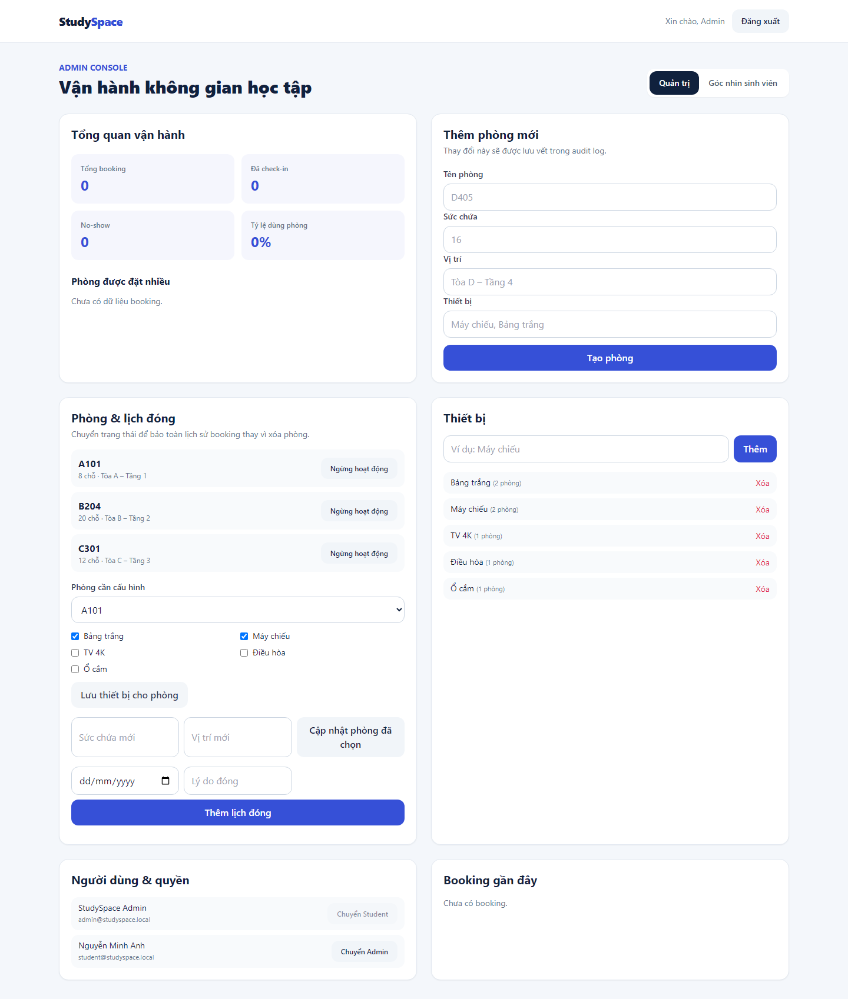

# BÁO CÁO BÀI TẬP LỚN

## Đánh giá và kiểm định chất lượng phần mềm — StudySpace

StudySpace là hệ thống quản lý phòng học và đặt chỗ, được xây dựng làm **Software Under Test (SUT)** cho học phần. Báo cáo này tổng hợp đặc tả, triển khai và kết quả kiểm định; bộ công cụ kiểm thử là phương tiện đánh giá SUT, không phải sản phẩm của đề tài.

## 1. Tóm tắt dự án và phạm vi

Hệ thống có hai vai trò: `STUDENT` tìm phòng, đặt/hủy/check-in và quản lý hồ sơ; `ADMIN` quản lý người dùng, phòng, thiết bị, lịch đóng, booking và báo cáo. Phạm vi chủ đích không gồm thanh toán, OAuth, email/SMS, bản đồ, đa cơ sở hoặc chat thời gian thực.

| Phân hệ | Nội dung kiểm định trọng tâm |
|---|---|
| Xác thực và phân quyền | JWT, RBAC, validation, rate limiting login và security header |
| Phòng học | Room ACTIVE/INACTIVE, thiết bị, sức chứa và lịch đóng |
| Booking | Slot 60 phút, giới hạn 14 ngày, conflict, hủy, check-in và audit trail |
| Vận hành | Quản lý user/booking và aggregate báo cáo sử dụng |

## 2. Đặc tả và thiết kế

SRS xác định 15 requirement thuộc bốn nhóm `REQ-AUTH-*`, `REQ-ROOM-*`, `REQ-BOOK-*` và `REQ-REPORT-*`. Mọi requirement có use case, precondition, main flow, alternate/exception flow, test case và evidence trong RTM.

Kiến trúc ba tầng gồm React/Vite/TypeScript/Tailwind ở presentation, Express/Zod/JWT/RBAC/domain policy ở application, và Prisma/SQLite ở data. Các thực thể nghiệp vụ là `User`, `Room`, `Equipment`, `RoomEquipment`, `RoomClosure`, `Booking` và `AuditLog`.

Booking sử dụng hai active key duy nhất theo phòng-slot và user-slot. Transaction, xử lý unique conflict thành HTTP `409`, cùng hàng đợi write trong SQLite single-instance bảo vệ tính toàn vẹn khi request đồng thời. Room có lịch sử chỉ chuyển `INACTIVE`, không xóa lịch sử nghiệp vụ.

Sơ đồ use case, ERD và component diagram nằm tại `docs/00-diagrams.md`; đặc tả đầy đủ nằm tại `docs/01-srs.md`.

## 3. Kế hoạch kiểm thử

Chiến lược tuân theo testing pyramid: kiểm tra nhanh ở domain/service, kiểm tra contract ở API/database và xác nhận hành vi người dùng qua trình duyệt. Các kỹ thuật được ghi trực tiếp trong Test Case Catalog.

| Tầng | Công cụ | Kỹ thuật | Mục tiêu |
|---|---|---|---|
| Unit | Vitest, V8 | White-box, BVA, state transition | Quy tắc slot, ngày, hủy và check-in |
| Property-based | fast-check | Invariant, BVA | 14 slot, khoảng ngày 14 ngày, cửa sổ check-in |
| API/database | Supertest, Prisma, SQLite | API black-box, EP, decision table, concurrency | HTTP contract, RBAC, audit, transaction và conflict |
| E2E | Playwright, axe | Scenario-based, accessibility | Student/admin flow trên Chromium |
| Non-functional | k6, ZAP, Lighthouse | Load, security baseline, usability | p95/error rate, alert level, quality UI |
| Mutation | StrykerJS | Mutation testing | Độ nhạy của test domain policy |

Entry criteria gồm migration test database thành công, dữ liệu seed, build được và browser E2E sẵn sàng. Exit criteria: tất cả test pass; coverage line >=85%, branch >=70%; mutation >=60%; không có ZAP High; race booking có đúng một `201` và các request còn lại `409`.

## 4. Thực hiện kiểm thử

Test Case Catalog có 56 ca test truy vết được. Nhóm property-based bổ sung ba invariant thuần cho `booking-policy.ts`: thời lượng slot, khoảng ngày hợp lệ và cửa sổ check-in. API test bao phủ ca hợp lệ, validation, auth, RBAC, not-found, conflict và audit. E2E xác nhận luồng đặt/hủy, đăng ký, cập nhật hồ sơ, admin operation, filter room và accessibility login.

*Hình 1. Student portal: tra cứu phòng theo ngày, sức chứa, thiết bị và slot.*

*Hình 2. Admin console: dashboard, phòng, thiết bị, closure và quản trị user.*

## 5. Kết quả tổng hợp

| Hoạt động | Kết quả đã xác minh | Evidence |
|---|---:|---|
| Unit + property-based + API | 43/43 pass | `docs/evidence/coverage-summary.json` |
| V8 coverage | 97.23% line; 91.21% branch; 94.11% function | `docs/evidence/coverage-summary.json` |
| Mutation | 57 killed; 6 survived; 5 compile-error; 90.48% | `docs/evidence/stryker-summary.json` |
| E2E Chromium | 20/20 pass; axe login không có serious/critical | Playwright report |
| k6 availability | 20 VUs/2 phút; error 0%; p95 17.47 ms | k6 summary |
| k6 booking race | 1 response `201`, 19 response `409`; error 0%; p95 292.09 ms | k6 race summary |
| ZAP baseline | 0 High, 0 Medium, 0 Low; 2 Informational | ZAP report |
| Lighthouse | Performance 100; Accessibility 100; Best Practices 96 | Lighthouse summary |

Mutation score được áp dụng cho `booking-policy.ts`, không suy diễn cho toàn bộ application. k6 race xác nhận business outcome mong đợi thay vì coi HTTP `409` là lỗi tải. ZAP baseline là scan giới hạn theo target production preview; các giới hạn được ghi rõ trong security checklist.

## 6. Truy vết và defect management

RTM hiện có 15/15 requirement được liên kết đến test case, source test và evidence. Bug reports ghi lỗi có thể tái hiện, expected/actual result, severity, fix commit và retest. Ví dụ, `BUG-007` liên kết `REQ-BOOK-04` với `TC-API-36`, xác minh check-in thành công có audit log.

| Nhóm requirement | Kỹ thuật representative | Evidence chính |
|---|---|---|
| AUTH | API black-box, security negative, E2E | auth/RBAC/rate-limit API test |
| ROOM | EP, BVA, API black-box, E2E | room/closure/equipment API test |
| BOOK | BVA, state transition, property-based, concurrency | domain test, API conflict, k6 |
| REPORT | BVA, decision table, API black-box | usage report API và admin E2E |

## 7. Đánh giá chất lượng ISO/IEC 25010

Functional suitability được hỗ trợ bằng coverage requirement 100% trong RTM và các luồng E2E. Reliability được tăng cường bởi transaction, active key, concurrency test và reset database isolation. Security gồm JWT/RBAC, validation, Helmet, configured CORS, login rate-limit và ZAP baseline. Maintainability có TypeScript strict, migration versioned, coverage và mutation score. Usability có responsive UI, axe và Lighthouse. Performance efficiency có số liệu k6 thật; compatibility và portability dựa trên REST/JSON, browser Chromium và workflow CI tái lập được.

## 8. Kết luận

StudySpace đáp ứng vai trò SUT hoàn chỉnh cho phương án “xây dựng ứng dụng và kiểm định tự động nhiều tầng”. Hồ sơ không chỉ liệt kê công cụ: mỗi kết luận chất lượng được liên kết đến requirement, test, evidence hoặc defect. Những giới hạn còn lại được ghi rõ thay vì suy diễn: không có integration thanh toán/OAuth và ZAP là baseline, không thay thế penetration test chuyên sâu.

## Tài liệu tham khảo

Danh mục đầy đủ tại `docs/10-references.md`: ISO/IEC 25010:2023; tài liệu chính thức Vitest, Playwright, StrykerJS, Grafana k6, OWASP ZAP và Lighthouse.
